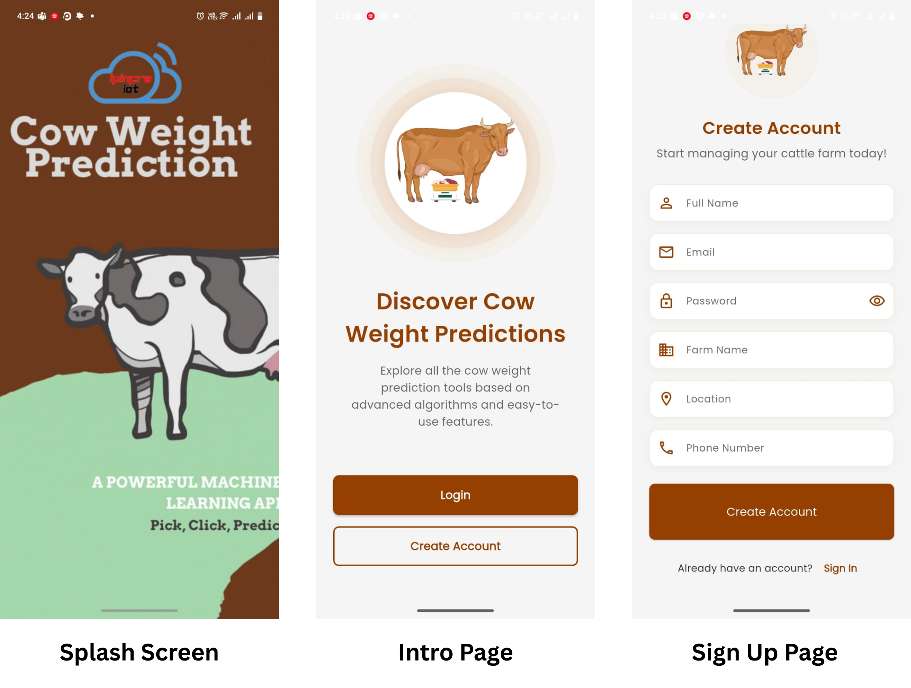
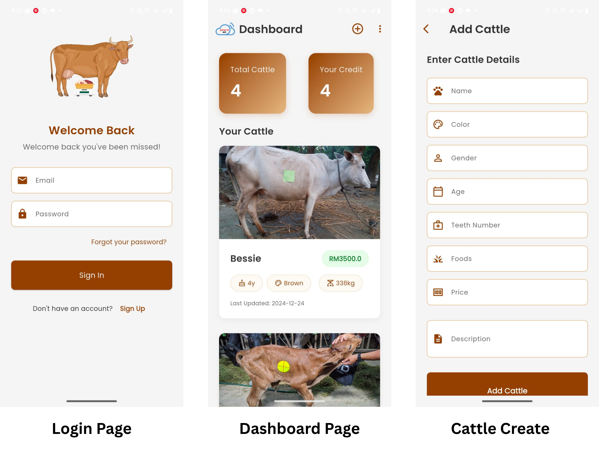
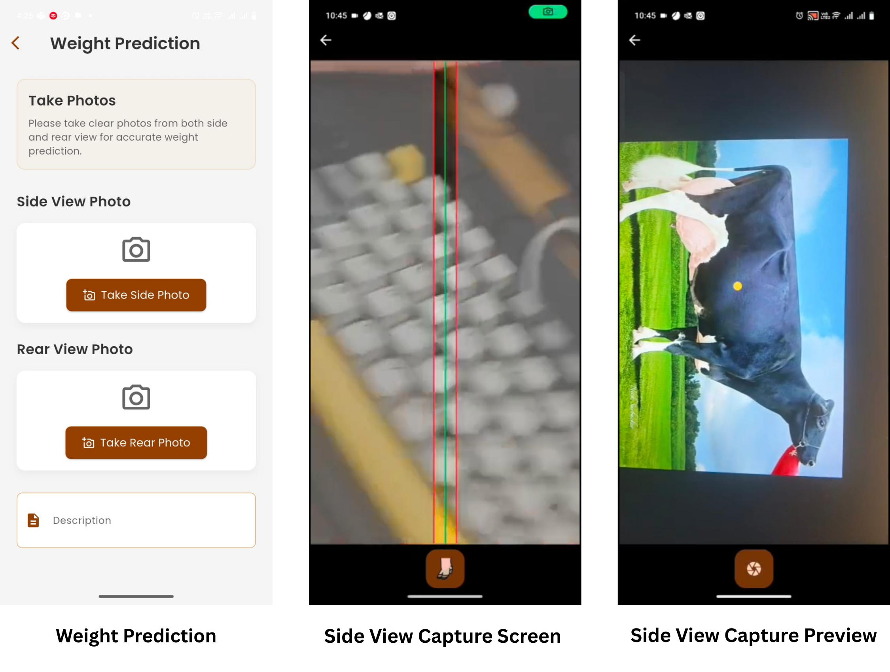
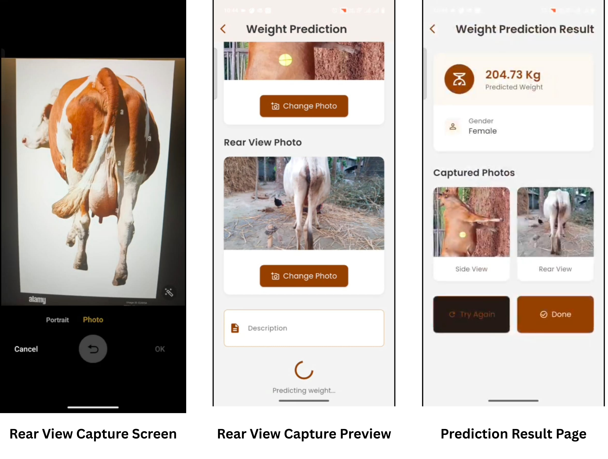

# 🐄 Cattle Management Mobile App

## 📖 Project Summary

This is a **Flutter-based mobile application** designed to help farmers manage their cattle more efficiently. The app allows users to **register, monitor, and predict cattle weight** using image-based AI integration. By leveraging built-in mobile sensors and camera input, the app provides a seamless way to track cattle health, manage farm operations, and store detailed information about each animal.

The system also includes a **weight prediction mechanism**: when users capture side and rear images of a cow, the app automatically detects the cow’s distance from the camera and predicts weight using sticker-size scaling relative to the distance.

👉 [Download APK](https://drive.google.com/drive/folders/1NiSlq1G0yVlNKxizsN24h3lfW0DhE4Tk?usp=sharing)

---

## 🛠️ Tech Stack

- **Framework**: Flutter (cross-platform mobile development)  
- **Language**: Dart  
- **UI Toolkit**: Flutter Widgets & Material Design  
- **State Management**: Provider, Shared Preferences  
- **Packages Used**:  
  - `image_picker`  
  - `http`  
  - `shared_preferences`  
  - `google_fonts`  
  - `url_launcher`  
- **Sensor Usage**: Mobile camera & tilting sensor for cattle image capture & weight prediction  
- **Backend Integration**: (via API – see backend project)  

---

## 🚀 Features

- **User Authentication**  
  - Create account with name, email, farm details, and phone number  
  - Login / logout with secure credentials  
  - Edit profile and change password  

- **Cattle Management**  
  - Add new cattle with details: name, color, gender, teeth number, food habits, price, and description  
  - View a dashboard of all cattle with basic info (color, weight, price)  
  - Store and update cattle history (age, color, gender, etc.)  

- **Weight Prediction System**  
  - Capture **side view** and **rear view** images of cattle  
  - AI-based mechanism predicts weight using camera + sensor data  
  - Shows **predicted weight result** with gender classification  
  - Stores captured photos for reference  

- **Weight History Tracking**  
  - Maintain historical records of cattle weight over time  
  - Chronological display of past measurements  

- **Farmer Profile Management**  
  - Edit farm details (farm name, location, credit info)  
  - Profile page with all farmer info  

---

## 📱 Screenshots

### 📌 Demo Preview

---

### 📱 Set 1
- **Splash Screen** – App logo and intro (“Cow Weight Prediction”)  
- **Onboarding / Intro Page** – “Discover Cow Weight Predictions”  
- **Sign Up Page** – Create account with full name, email, password, farm name, location, phone number  

---

### 📱 Set 2
- **Login Page** – Enter email & password, option for “Forgot Password”  
- **Dashboard Page** – Shows cattle count, credits, and cattle list (with image, weight, price, color, age)  
- **Sign Up Page (alternate view)** – Same create account form as in Set 1  

---

### 📱 Set 3
- **Weight Prediction (Capture Options)** – Buttons for side view and rear view photo  
- **Side View Capture Screen** – Camera alignment with guide lines  
- **Side View Capture Preview** – Cow image with sticker for prediction reference  

---

### 📱 Set 4
- **Rear View Capture Screen** – Camera open for capturing rear view  
- **Rear View Capture Preview** – Captured rear photo with replace option  
- **Prediction Result Page** – Displays predicted weight, gender, and captured photos (side & rear)  

---
